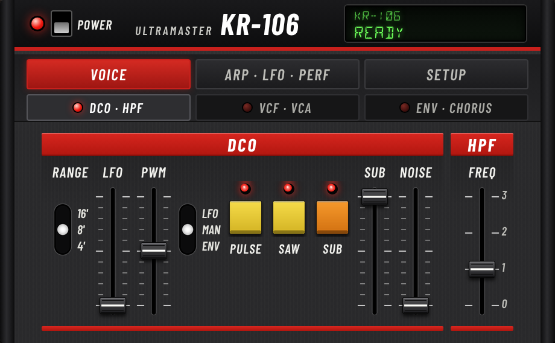

# KR-106 for MOD (mod-host / mod-ui)

A headless LV2 build of the Ultramaster KR-106 for [MOD](https://mod.audio) systems:
MOD Dwarf / Duo X, and mod-host + mod-ui on a Raspberry Pi or a PC. It ships with
a tabbed modgui in the Juno-106 panel style.



How it differs from the JUCE LV2 build (`KR106_artefacts/LV2`):

| | JUCE LV2 | MOD LV2 (this folder) |
|---|---|---|
| Parameters | `patch:Parameter` (atom messages) | `lv2:ControlPort` for every control |
| mod-ui MIDI learn, actuators, snapshots | no | yes |
| GUI | JUCE window (X11) | modgui (HTML, rendered by mod-ui) |
| Runtime dependencies | X11, freetype, fontconfig, GL | libstdc++ only |
| Plugin URI | `https://kayrock.org/kr106` | `https://kayrock.org/kr106/mod` |

The DSP engine is the same code (`Source/DSP`), used directly without JUCE.

## Building

You need a C++17 compiler and the LV2 headers (`apt install lv2-dev`). If the
headers aren't installed, the copy that ships with the JUCE submodule is used.

```bash
cd mod
make                 # -> build/kr106-mod.lv2
make install         # copies the bundle to ~/.lv2 (LV2DIR=... to change)
```

On a Raspberry Pi 5, build natively the same way. To cross-compile, set the
target compiler; the TTL generator still runs on the build machine:

```bash
make CXX=aarch64-linux-gnu-g++ CXXFLAGS="-O3 -mcpu=cortex-a76"
```

For mod-plugin-builder, call `make` with the toolchain's `CXX`. `HOST_CXX`
defaults to `c++`.

Checks:

```bash
make validate        # lv2_validate (lilv-utils)
make test            # renders notes, presets, arp, hold through lilv (liblilv-dev)
```

## Panel

The panel is 920 × 568 px (mod-ui shows plugins zoomed out, so it is drawn large). Three main tabs, each with three sub-tabs (the lit
LED marks the active one). No keyboard is drawn; play the synth from a MIDI
controller.

| Tab | Sub-tabs |
|---|---|
| **VOICE** | DCO · HPF / VCF · VCA / ENV · CHORUS |
| **ARP · LFO · PERF** | ARPEGGIO (host tempo sync) / LFO (trigger button, sync) / PERFORMANCE (Hold, assign mode, portamento, bender and its DCO/VCF/LFO depths) |
| **SETUP** | MASTER · MODEL (volume, tuning, transpose, Juno-60 / Juno-106) / VOICES · KEYS (voice count, oscillator mode, VCF oversampling, velocity, retrigger) / INFO |

Each main tab remembers its last sub-tab.

The LCD in the header shows the last control you moved, as a 7-bit value
(0–127) like a Juno-106 slider, or as its label for switches.

Every control is a regular LV2 control port. From the plugin's settings
(gear icon) you can MIDI-learn it or assign it to an actuator. For
example, put HOLD or LFO TRIG on a footswitch (LFO TRIG is momentary by default).

## MIDI

- Notes (omni), pitch bend (added to the BEND control)
- CC1 mod wheel = LFO trigger, CC64 sustain = Hold, CC120/123 = all notes off
- Host transport (`time:Position`): arpeggiator and LFO sync

The plugin doesn't use the Juno-106 CC map or SysEx. With control ports, a
parameter changed by the plugin itself wouldn't show up in mod-ui. Use mod-ui
MIDI learn instead.

## Presets

The 240 factory patches (J60 and J106 banks) are LV2 presets, in the plugin's
preset menu. A preset sets the sound (DCO through Chorus, LFO, model) and
leaves the performance controls (arpeggio, hold, portamento, volume, setup)
alone.

## Notes

- The plugin always runs every voice, including idle ones (as the hardware does), so CPU
  load is constant. On a Raspberry Pi 5, expect about 30–40 % of one core at
  48 kHz with 6 voices. Keep 6 voices and 48 kHz on small systems.
- Switching MODEL doesn't rescale the VCF frequency and HPF sliders (the JUCE
  build does). The panel always shows the actual value.

## Regenerating the modgui

`modgui/` is generated and committed, so building needs neither Python nor
Pillow. After changing the port table (`src/kr106_mod_ports.h`) or the panel
layout (`tools/gen_modgui.py`):

```bash
make modgui          # needs python3 + Pillow
```

The faders, switches, buttons and LEDs are drawn by the script at 2x with
supersampling. `screenshot-kr106.png` and `thumbnail-kr106.png` are captures
of the panel rendered in mod-ui.

Only append new ports at the end of `kControlPorts`. Saved pedalboards store
port symbols.

## Files

```
src/kr106_mod.cpp          LV2 plugin (wraps Source/DSP)
src/kr106_mod_ports.h      port table: single source for plugin, TTL and modgui
tools/kr106_mod_ttlgen.cpp writes manifest.ttl, kr106.ttl, presets.ttl
tools/gen_modgui.py        writes modgui/ and modgui.ttl
tools/kr106_mod_test.cpp   lilv smoke test
modgui/fonts/              Barlow Condensed and Segment14 (SIL OFL 1.1)
```
